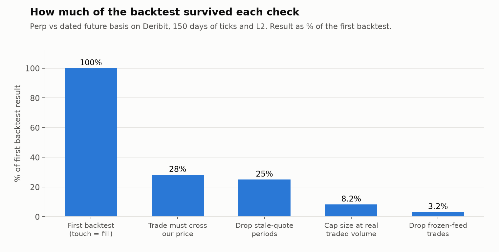
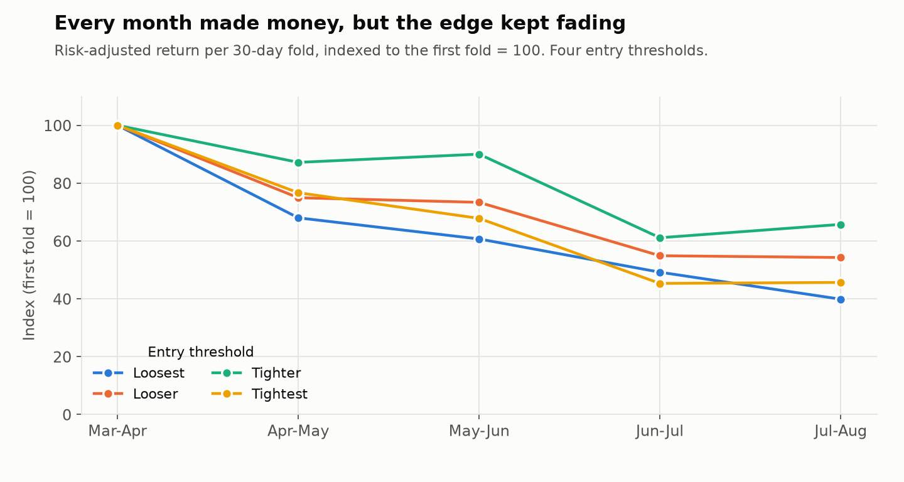

# Perp vs Dated Future Basis on Deribit

Mean reversion of the gap between the BTC perpetual and a dated future on the same venue. 150 days of tick quotes, trades and L2. This is the one study that passed every check, and the checks are the interesting part.

## The checks

Each step removes something the backtest was getting for free.

1. First backtest: a resting order fills whenever the price touches it
2. A trade has to print through our price, not just touch it
3. Drop trades that happen near gaps in the quote feed
4. Cap the size of each fill at the volume that actually traded there
5. Drop trades next to frozen-feed periods, after checking the top trades one by one

About 3% of the first backtest's result was left at the end. Most of the drop came from fills, not from the signal.

## Walk-forward

I split the final trade set into five 30-day folds. Every fold made money for every threshold tested. But risk-adjusted return fell steadily from the first month to the last.

So the full-period average overstates what to expect next. I used the latest fold as the forward estimate, not the average.

## Limits

- Capacity is small. Only a few percent of the target size could actually be filled.
- No execution latency model yet.
- The same checks were run on a second, newer expiry, which showed the same fading pattern.

[Back to all studies](../README.md)
