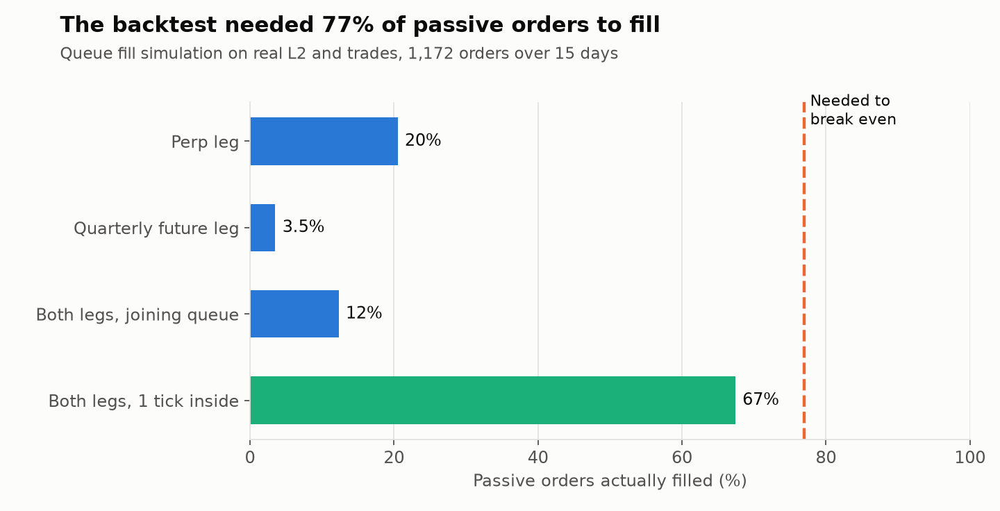

# The Fill Rate Problem

Same idea as the Deribit study, the perp vs a quarterly future, but on a different major venue. The signal was real: after removing the slow roll-down of the basis, the gap mean-reverted with a half-life of about 5 minutes. The first backtest won 81% of its trades.

The catch: the signal moves only a few basis points, so it only works with passive orders on both legs. The backtest needed 77% of those orders to fill to break even.

## Real fills

I rebuilt the top of book from the archive and simulated each order's place in the queue against the real trades. 1,172 orders on 15 days spread across the period.

The quarterly future traded about 250 times less volume per day than the perp, and its leg filled 3 to 4% of the time. Applying the real fill rates turned a profitable backtest into a clear loss.

## What I tried

- Quoting 1 tick inside the spread raised fills to 67%, but gave up enough edge that it still lost money.
- Wider entry thresholds turned marginally positive on very few trades. Checking those trades one by one, half the profit at the widest setting came from single-bar stale-quote spikes.
- Trading only in the most liquid hours flipped those thin positive results negative, which showed they were noise.

I stopped there on purpose. More tuning on the same data would have found something that looked good by chance.

[Back to all studies](../README.md)
