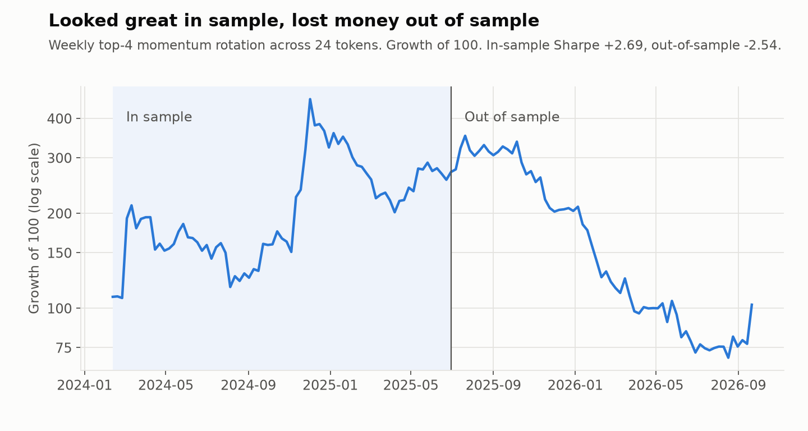

# Overfitting: Token Rotation

A weekly rotation into the top 4 of 24 tokens by trailing 30-day return. Daily data from 2024 to 2026, with the walk-forward split fixed at the end of June 2025 before looking at results.

In sample it had a Sharpe of +2.69, the best number in the whole project. Out of sample it was -2.54 with an 85% drawdown. The sample wasn't small: 72 weeks in, 65 weeks out. Whatever leadership pattern drove the alt and meme rally in 2024 reversed afterwards.

This was one of seven different mechanisms I tested on the same data after the main trend strategy: mean reversion, channel breakout, rotation, pooled ML across tokens, BTC-ETH pairs, calendar effects and funding carry. All seven failed for reasons I could explain. One calendar effect had p = 0.04, then lost money both in and out of sample once it was turned into a trading rule. A good reminder of what multiple comparisons do.

At 0 for 7, I stopped testing new mechanisms without a specific reason to expect each one to work. Every extra test raises the chance of a false positive.

[Back to all studies](../README.md)
